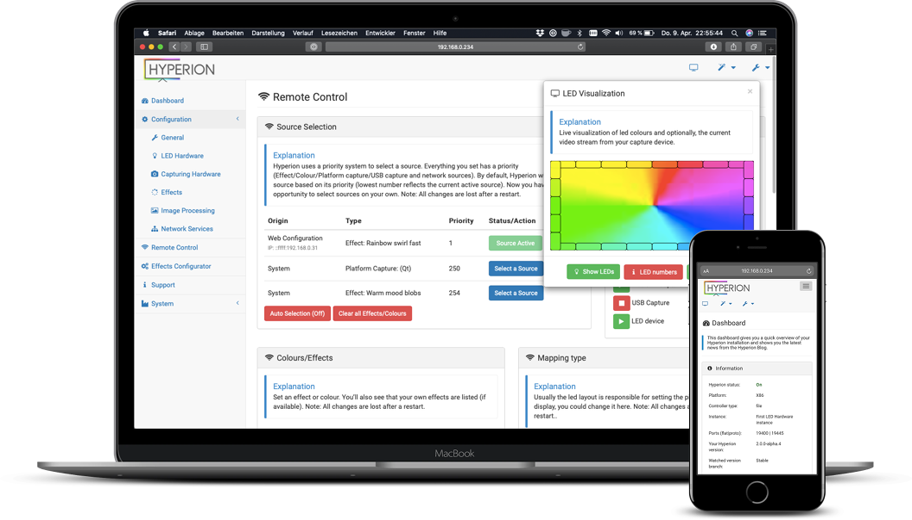

## About Hyperion

[Hyperion](https://github.com/hyperion-project/hyperion.ng) is an opensource [Bias or Ambient Lighting](https://en.wikipedia.org/wiki/Bias_lighting) implementation which you might know from TV manufacturers. It supports many LED devices and video grabbers.

### Features:

* Low CPU load makes it perfect for SoCs like Raspberry Pi
* Json interface which allows easy integration into scripts
* A command line utility for testing and integration in automated environment
* Priority channels are not coupled to a specific led data provider which means that a provider can post led data and leave without the need to maintain a connection to Hyperion. This is ideal for a remote application (like our [Android app](https://play.google.com/store/apps/details?id=nl.hyperion.hyperionpro)).
* Black border detector and processor
* A scriptable (Python) effect engine with 39 build-in effects for your inspiration
* A multi language web interface to configure and remote control hyperion

### Supported Hardware

You can find a list of supported hardware [here](https://docs.hyperion-project.org/en/user/leddevices/).

If you need further support please open a topic at the forum! 

## Contributing

Contributions are welcome! Feel free to join us! We are looking always for people who wants to participate. 

For an example, you can participate in the translation. 

## Supported Platforms

Find here more details on [supported platforms and configuration sets](doc/development/SupportedPlatforms.md)

## Documentation
Covers these topics:
- [Installation](https://docs.hyperion-project.org/en/user/Installation.html)
- [Configuration](https://docs.hyperion-project.org/en/user/Configuration.html)
- [Effect development](https://docs.hyperion-project.org/en/effects/#effect-files)
- [JSON API](https://docs.hyperion-project.org/en/json/)

## Changelog
Released and unreleased changes at [CHANGELOG.md](CHANGELOG.md)

## Building
See [CompileHowto.md](doc/development/CompileHowto.md).

## Installation
See [Documentation](https://docs.hyperion-project.org/en/user/Installation.html) or at [Installation.md](Installation.md).

## Download
Releases available from the [Hyperion release page](https://github.com/hyperion-project/hyperion.ng/releases)

## Privacy Policy
See [PRIVACY.md](PRIVACY.md).

## License
The source is released under MIT-License (see https://opensource.org/licenses/MIT). 

