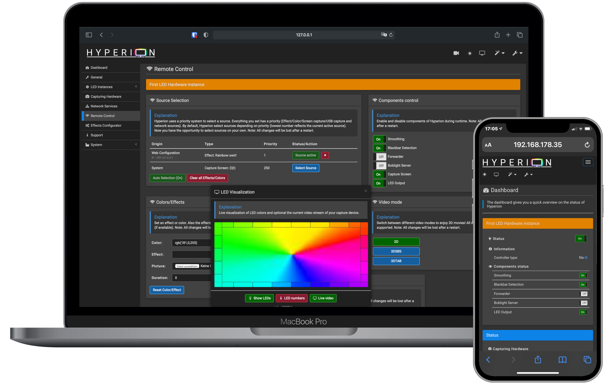

<picture>
  <source media="(prefers-color-scheme: dark)" srcset="doc/logo_dark.png">
  <source media="(prefers-color-scheme: light)" srcset="doc/logo_light.png">
  
</picture>

[![Package-Repository](https://img.shields.io/badge/Package%20Repository-online-4bc51d?logo=data:image/svg%2bxml;base64,PD94bWwgdmVyc2lvbj0iMS4wIiBlbmNvZGluZz0iVVRGLTgiIHN0YW5kYWxvbmU9Im5vIj8+PCFET0NUWVBFIHN2ZyBQVUJMSUMgIi0vL1czQy8vRFREIFNWRyAxLjEvL0VOIiAiaHR0cDovL3d3dy53My5vcmcvR3JhcGhpY3MvU1ZHLzEuMS9EVEQvc3ZnMTEuZHRkIj48c3ZnIHdpZHRoPSIxMTZweCIgaGVpZ2h0PSIxMjNweCIgdmVyc2lvbj0iMS4xIiB4bWxucz0iaHR0cDovL3d3dy53My5vcmcvMjAwMC9zdmciIHhtbG5zOnhsaW5rPSJodHRwOi8vd3d3LnczLm9yZy8xOTk5L3hsaW5rIiB4bWw6c3BhY2U9InByZXNlcnZlIiB4bWxuczpzZXJpZj0iaHR0cDovL3d3dy5zZXJpZi5jb20vIiBzdHlsZT0iZmlsbC1ydWxlOmV2ZW5vZGQ7Y2xpcC1ydWxlOmV2ZW5vZGQ7c3Ryb2tlLWxpbmVqb2luOnJvdW5kO3N0cm9rZS1taXRlcmxpbWl0OjI7Ij48cGF0aCBkPSJNNTUuNzYsNzcuMzlMMTcuMTUsNTcuMTNMNy4xOCw2OUMyMS4xOCw3Ni4zOCAzNC4wOCw4My4zNSA0OC4wNCw5MC43M0w1NS43Niw3Ny40NEw1NS43Niw3Ny4zOVpNNjguNDMsMEw2OC40MywyMS40NEw3OC40MywyMS40NEM3OS44MjQsMjEuMzYyIDgxLjE2NywyMS45OSA4MiwyMy4xMUM4My44NiwyNS45MSA4MS4zMSwyOC42OCA3OS41NSwzMC42MkM3NC41NSwzNi4xMyA2My4xOSw0OC40MiA2MC43MSw1MS4zMkM1OS45MzUsNTIuMzAyIDU4Ljc1MSw1Mi44NzUgNTcuNSw1Mi44NzVDNTYuMjQ5LDUyLjg3NSA1NS4wNjUsNTIuMzAyIDU0LjI5LDUxLjMyQzUxLjczLDQ4LjMyIDM5Ljc0LDM1LjQ2IDM0Ljk3LDMwLjA5QzMzLjMyLDI4LjIzIDMxLjI3LDI1LjY5IDMyLjk3LDIzLjA5QzMzLjgwMSwyMS45NzMgMzUuMTQsMjEuMzQ1IDM2LjUzLDIxLjQyTDQ2LjUzLDIxLjQyTDQ2LjUzLDBMNjguNDMsMFpNMzUuNDMsNDYuMzRMMTkuNzcsNTQuMTJMNTguMjYsNzQuMzVMOTYuODIsNTQuMDhMODAuMjgsNDUuNDhMODIuOTgsNDIuNDhMOTcuOTgsNTAuMjJMMTA4Ljg1LDQwTDkyLjM2LDMxQzkyLjk5NCwyOS43NDUgOTMuNDEzLDI4LjM5MyA5My42LDI3TDExNC4yMywzNy45QzExNC4zNjUsMzcuOTcyIDExNC40ODcsMzguMDY3IDExNC41OSwzOC4xOEMxMTQuODY2LDM4LjQ1NiAxMTUuMDIxLDM4LjgzIDExNS4wMjEsMzkuMjJDMTE1LjAyMSwzOS42MSAxMTQuODY2LDM5Ljk4NCAxMTQuNTksNDAuMjZMMTAxLjM0LDUzLjI2TDExNC4xNyw2OC42MkMxMTQuNjksNjkuMjQ0IDExNC42MDksNzAuMTg0IDExMy45OSw3MC43MUMxMTMuODk1LDcwLjc4IDExMy43OTQsNzAuODQ0IDExMy42OSw3MC45TDEwMi4xNCw3N0wxMDIuMTQsOTkuODhDMTAyLjEzOSwxMDAuNDc3IDEwMS43OCwxMDEuMDE4IDEwMS4yMywxMDEuMjVMNTkuNTcsMTIyLjM5QzU5LjI5LDEyMi43IDU4Ljg5MSwxMjIuODc3IDU4LjQ3MywxMjIuODc3QzU3LjkxNCwxMjIuODc3IDU3LjQwMSwxMjIuNTYgNTcuMTUsMTIyLjA2TDE1LjQxLDEwMS4yQzE0LjkxNCwxMDAuOTQ4IDE0LjYsMTAwLjQzNyAxNC42LDk5Ljg4TDE0LjYsNzcuMTZMMi44NSw3MUMyLjc0Niw3MC45NDQgMi42NDUsNzAuODggMi41NSw3MC44MUMxLjkzMSw3MC4yODQgMS44NSw2OS4zNDQgMi4zNyw2OC43MkwxNC44Nyw1My43MkwwLjM2LDQwQzAuMTE3LDM5LjcyNyAtMC4wMTcsMzkuMzc0IC0wLjAxNywzOS4wMDlDLTAuMDE3LDM4LjU3NSAwLjE3MiwzOC4xNjMgMC41LDM3Ljg4QzAuNTksMzcuODA4IDAuNjg3LDM3Ljc0NCAwLjc5LDM3LjY5TDIxLjczLDI1Ljg0QzIxLjgyNywyNy4yODcgMjIuMTM0LDI4LjcxMSAyMi42NCwzMC4wN0w1LjY5LDM5LjcxTDE3LjUyLDUwLjcxTDMyLjYxLDQzLjI0TDM1LjQ2LDQ2LjM1TDM1LjQzLDQ2LjM0Wk05OS41OSw1Ny4yOEw2MS4wNSw3Ny41TDY4LjU2LDkwLjgyTDEwOS4xMSw2OC44Mkw5OS41OSw1Ny4yOFoiIHN0eWxlPSJmaWxsOndoaXRlO2ZpbGwtcnVsZTpub256ZXJvOyIvPjwvc3ZnPg==)](https://releases.hyperion-project.org)

## About Hyperion

[Hyperion](https://github.com/hyperion-project/hyperion.ng) is an opensource [Bias or Ambient Lighting](https://en.wikipedia.org/wiki/Bias_lighting) implementation which you might know from TV manufacturers. It supports many LED devices and video grabbers.

### Features:

* Low CPU load makes it perfect for SoCs like Raspberry Pi
* Json interface which allows easy integration into scripts
* A command line utility for testing and integration in automated environment
* Priority channels are not coupled to a specific led data provider which means that a provider can post led data and leave without the need to maintain a connection to Hyperion. This is ideal for a remote application (like our former [Android app](https://play.google.com/store/apps/details?id=nl.hyperion.hyperionpro), which is no longer available).
* Black border detector and processor
* A scriptable (Python) effect engine with 39 build-in effects for your inspiration
* A multi language web interface to configure and remote control hyperion

### Supported Hardware

You can find a list of supported hardware [here](https://docs.hyperion-project.org/user/leddevices/Overview.html).

If you need further support please open a topic at the forum! 

## Contributing

Contributions are welcome! Feel free to join us! We are looking always for people who wants to participate. 

For an example, you can participate in the translation. 

## Supported Platforms

Find here more details on [supported platforms and configuration sets](doc/development/SupportedPlatforms.md).

## Documentation
Covers these topics:
- [Installation](https://docs.hyperion-project.org/en/user/Installation.html)
- [Configuration](https://docs.hyperion-project.org/en/user/Configuration.html)
- [Effect development](https://docs.hyperion-project.org/en/effects/#effect-files)
- [JSON API](https://docs.hyperion-project.org/en/json/)

## Changelog
Released and unreleased changes at [CHANGELOG.md](CHANGELOG.md).

## Building
See [CompileHowto.md](doc/development/CompileHowto.md).

## Installation
See [Documentation](https://docs.hyperion-project.org/en/user/Installation.html) or on the [Release Repository](https://releases.hyperion-project.org).

## Download
GitHub Releases are available on the [Hyperion release page](https://github.com/hyperion-project/hyperion.ng/releases).

## Privacy Policy
See [PRIVACY.md](PRIVACY.md).

## License
The source is released under MIT-License (see https://opensource.org/licenses/MIT). 

